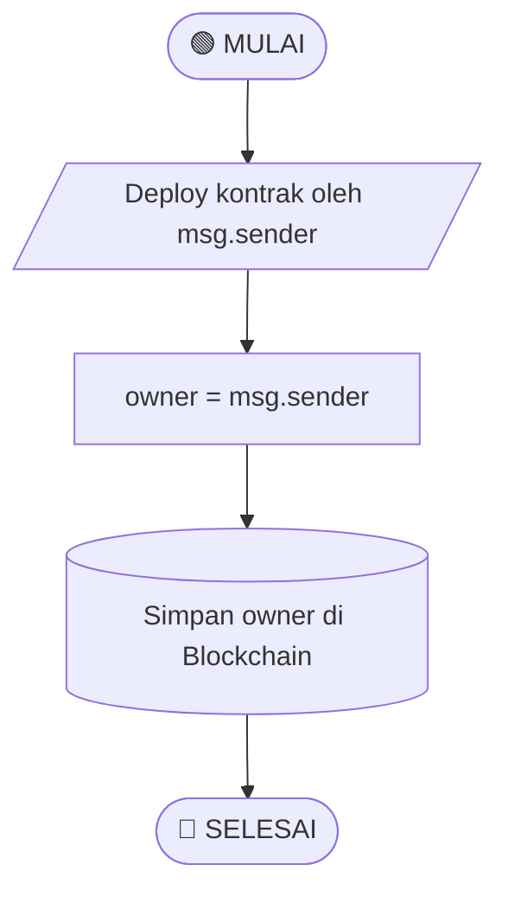
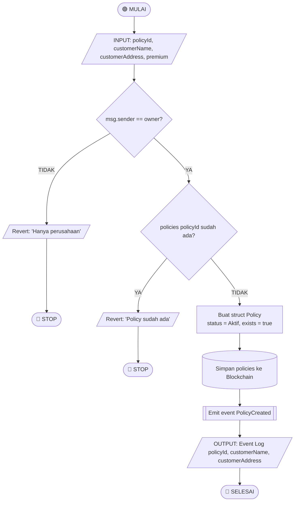
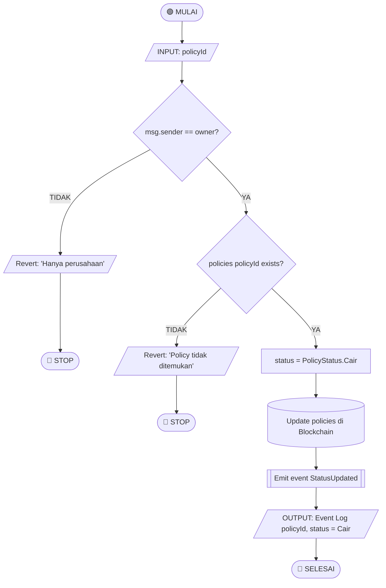
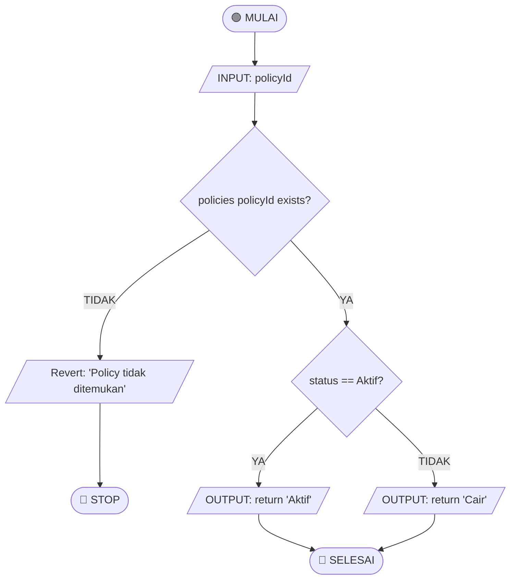
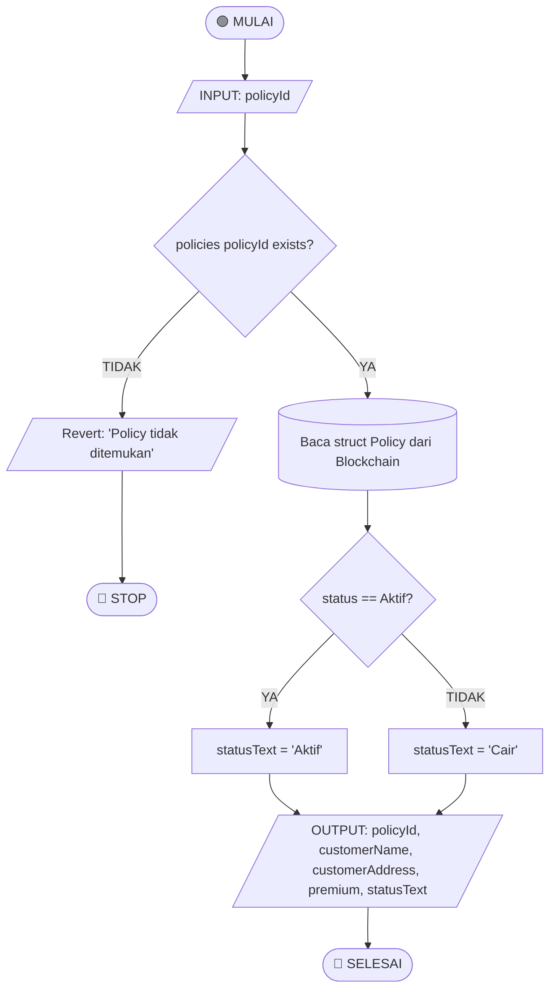
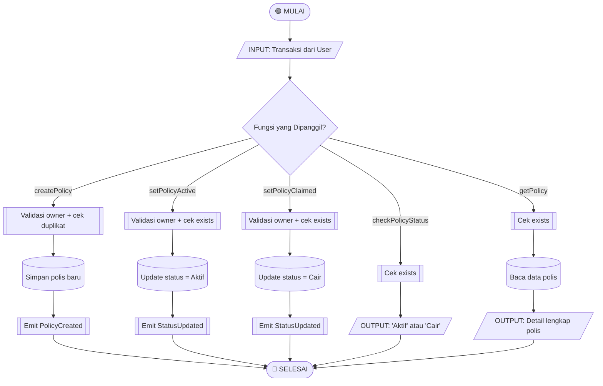
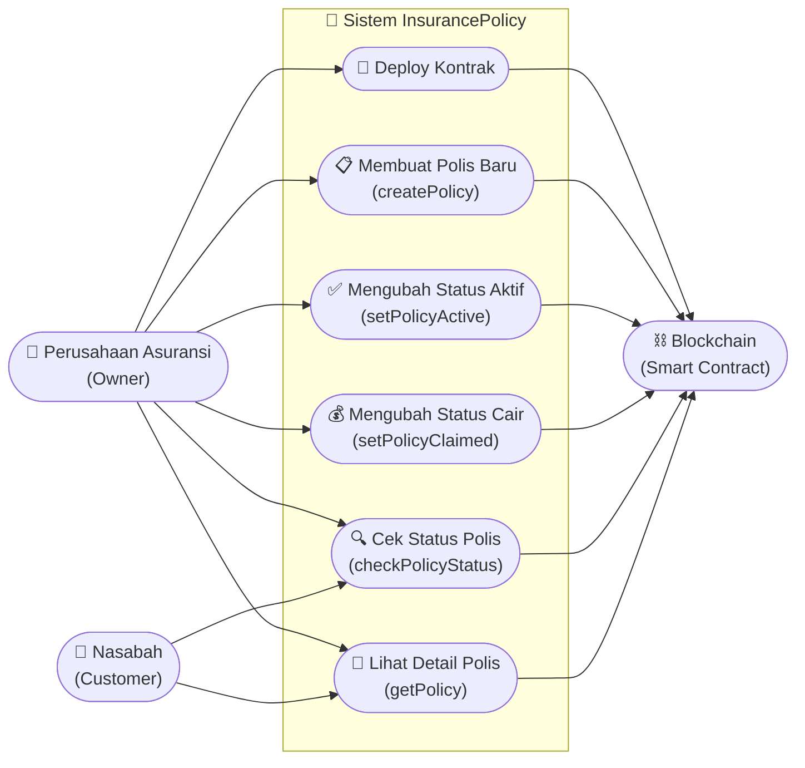

# Diagram Alir — Smart Contract `InsurancePolicy`

---

## 1. Deployment Kontrak

---

## 2. `createPolicy` — Membuat Polis Baru

---

## 3. `setPolicyActive` — Ubah Status Menjadi Aktif

---

## 4. `setPolicyClaimed` — Ubah Status Menjadi Cair

---

## 5. `checkPolicyStatus` — Cek Status Polis

---

## 6. `getPolicy` — Ambil Detail Polis

---

## 7. Sistem Keseluruhan

---

# Diagram Use Case — Smart Contract `InsurancePolicy`

---

## Tabel Relasi Use Case

| Use Case | Aktor | Akses | Keterangan |
|---|---|---|---|
| Deploy Kontrak | Perusahaan Asuransi | `onlyOwner` | Inisialisasi kontrak, set owner |
| `createPolicy` | Perusahaan Asuransi | `onlyOwner` | Membuat polis baru untuk nasabah |
| `setPolicyActive` | Perusahaan Asuransi | `onlyOwner` | Mengubah status polis menjadi Aktif |
| `setPolicyClaimed` | Perusahaan Asuransi | `onlyOwner` | Mengubah status polis menjadi Cair |
| `checkPolicyStatus` | Perusahaan & Nasabah | `public view` | Melihat status polis (Aktif/Cair) |
| `getPolicy` | Perusahaan & Nasabah | `public view` | Melihat detail lengkap polis |
