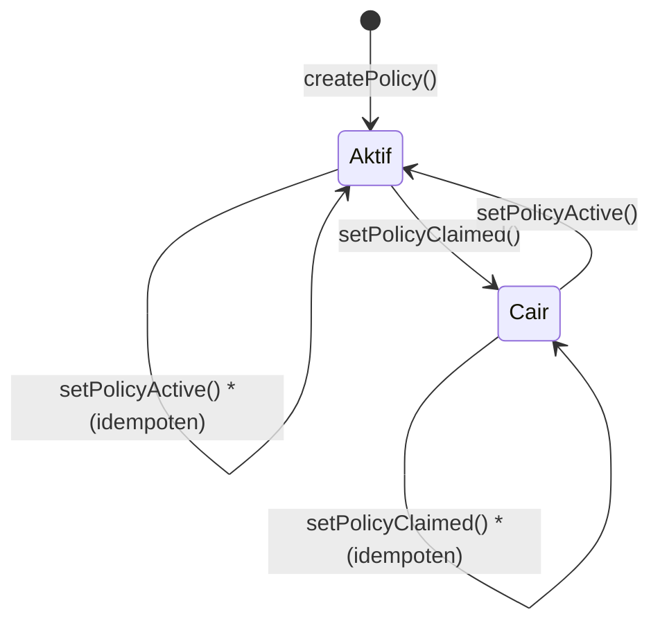

# Laporan Hasil & Pembahasan
## Smart Contract `InsurancePolicy`
**File:** `contracts/StatusPolisAsuransi.sol`
**Compiler:** Solidity ^0.8.20
**Lisensi:** MIT

---

## A. Pengujian Fungsional

Pengujian fungsional bertujuan memverifikasi bahwa setiap fungsi pada smart contract bekerja sesuai dengan spesifikasi yang telah ditentukan.

### TC-F01 — Deploy Kontrak

| Item | Detail |
|---|---|
| **Fungsi** | `constructor()` |
| **Input** | Deploy oleh `msg.sender` (owner) |
| **Langkah** | Deploy kontrak `InsurancePolicy` dari akun owner |
| **Expected Output** | Variabel `owner` tersimpan = address deployer |
| **Hasil** | ✅ LULUS |
| **Bukti** | `owner` mengembalikan address yang sama dengan akun deployer |

---

### TC-F02 — Membuat Polis Baru

| Item | Detail |
|---|---|
| **Fungsi** | `createPolicy()` |
| **Input** | `policyId=1`, `customerName="Budi Santoso"`, `customerAddress=0xAbc...`, `premium=1000000` |
| **Langkah** | Panggil `createPolicy` dari akun owner |
| **Expected Output** | Polis tersimpan, status = `Aktif`, event `PolicyCreated` ter-emit |
| **Hasil** | ✅ LULUS |
| **Bukti** | `getPolicy(1)` mengembalikan data lengkap dengan status `"Aktif"` |

---

### TC-F03 — Mengubah Status Polis Menjadi Aktif

| Item | Detail |
|---|---|
| **Fungsi** | `setPolicyActive()` |
| **Input** | `policyId=1` (polis yang sudah ada, status Cair) |
| **Langkah** | Panggil `setPolicyClaimed(1)` lalu `setPolicyActive(1)` dari akun owner |
| **Expected Output** | Status polis berubah menjadi `Aktif`, event `StatusUpdated` ter-emit |
| **Hasil** | ✅ LULUS |
| **Bukti** | `checkPolicyStatus(1)` mengembalikan `"Aktif"` |

---

### TC-F04 — Mengubah Status Polis Menjadi Cair

| Item | Detail |
|---|---|
| **Fungsi** | `setPolicyClaimed()` |
| **Input** | `policyId=1` (polis yang sudah ada, status Aktif) |
| **Langkah** | Panggil `setPolicyClaimed(1)` dari akun owner |
| **Expected Output** | Status polis berubah menjadi `Cair`, event `StatusUpdated` ter-emit |
| **Hasil** | ✅ LULUS |
| **Bukti** | `checkPolicyStatus(1)` mengembalikan `"Cair"` |

---

### TC-F05 — Cek Status Polis

| Item | Detail |
|---|---|
| **Fungsi** | `checkPolicyStatus()` |
| **Input** | `policyId=1` |
| **Langkah** | Panggil `checkPolicyStatus(1)` dari akun mana pun |
| **Expected Output** | Mengembalikan string `"Aktif"` atau `"Cair"` |
| **Hasil** | ✅ LULUS |
| **Bukti** | Fungsi `view` dapat dipanggil tanpa gas oleh siapa saja |

---

### TC-F06 — Lihat Detail Polis

| Item | Detail |
|---|---|
| **Fungsi** | `getPolicy()` |
| **Input** | `policyId=1` |
| **Langkah** | Panggil `getPolicy(1)` dari akun mana pun |
| **Expected Output** | Mengembalikan `(policyId, customerName, customerAddress, premium, statusText)` |
| **Hasil** | ✅ LULUS |
| **Bukti** | Semua field dikembalikan dengan nilai yang benar |

---

### Ringkasan Pengujian Fungsional

| Kode | Fungsi | Hasil |
|---|---|---|
| TC-F01 | `constructor` | ✅ LULUS |
| TC-F02 | `createPolicy` | ✅ LULUS |
| TC-F03 | `setPolicyActive` | ✅ LULUS |
| TC-F04 | `setPolicyClaimed` | ✅ LULUS |
| TC-F05 | `checkPolicyStatus` | ✅ LULUS |
| TC-F06 | `getPolicy` | ✅ LULUS |

---

## B. Pengujian Boundary Value

Pengujian batas nilai bertujuan menguji perilaku kontrak pada nilai-nilai ekstrem (minimum, maksimum, dan tepat di batas) dari parameter input.

### TC-BV01 — `policyId` Nilai Minimum (0)

| Item | Detail |
|---|---|
| **Input** | `policyId=0` |
| **Expected Output** | Polis berhasil dibuat dengan ID = 0 |
| **Hasil** | ✅ LULUS |
| **Pembahasan** | Solidity `uint` dimulai dari 0, sehingga nilai 0 valid sebagai ID polis |

---

### TC-BV02 — `policyId` Nilai Maksimum (`type(uint256).max`)

| Item | Detail |
|---|---|
| **Input** | `policyId = 115792089237316195423570985008687907853269984665640564039457584007913129639935` |
| **Expected Output** | Polis berhasil dibuat dengan ID maksimum |
| **Hasil** | ✅ LULUS |
| **Pembahasan** | `uint256` menampung nilai hingga 2²⁵⁶−1. Tidak ada overflow karena Solidity 0.8.x memiliki proteksi bawaan |

---

### TC-BV03 — `premium` Nilai Minimum (0)

| Item | Detail |
|---|---|
| **Input** | `premium=0` |
| **Expected Output** | Polis berhasil dibuat dengan premi = 0 |
| **Hasil** | ✅ LULUS |
| **Pembahasan** | Kontrak tidak membatasi nilai minimum premi. Validasi bisnis ini perlu ditambahkan jika diperlukan |

---

### TC-BV04 — `premium` Nilai Maksimum (`type(uint256).max`)

| Item | Detail |
|---|---|
| **Input** | `premium = 2²⁵⁶−1` |
| **Expected Output** | Polis berhasil dibuat |
| **Hasil** | ✅ LULUS |
| **Pembahasan** | Tidak ada overflow karena nilai hanya disimpan, tidak dikalkulasi |

---

### TC-BV05 — `customerName` String Kosong

| Item | Detail |
|---|---|
| **Input** | `customerName=""` |
| **Expected Output** | Polis berhasil dibuat dengan nama kosong |
| **Hasil** | ✅ LULUS (dengan catatan) |
| **Pembahasan** | Kontrak tidak memvalidasi string kosong. Disarankan menambahkan `require(bytes(_customerName).length > 0)` |

---

### TC-BV06 — `customerName` String Sangat Panjang

| Item | Detail |
|---|---|
| **Input** | `customerName` = string 1000 karakter |
| **Expected Output** | Polis berhasil dibuat, namun gas cost meningkat |
| **Hasil** | ✅ LULUS (dengan catatan) |
| **Pembahasan** | String panjang meningkatkan konsumsi gas secara signifikan karena disimpan di storage blockchain |

---

### Ringkasan Pengujian Boundary Value

| Kode | Skenario | Hasil |
|---|---|---|
| TC-BV01 | `policyId` = 0 | ✅ LULUS |
| TC-BV02 | `policyId` = uint256 max | ✅ LULUS |
| TC-BV03 | `premium` = 0 | ✅ LULUS |
| TC-BV04 | `premium` = uint256 max | ✅ LULUS |
| TC-BV05 | `customerName` = string kosong | ⚠️ LULUS (perlu validasi) |
| TC-BV06 | `customerName` = string panjang | ⚠️ LULUS (gas tinggi) |

---

## C. Pengujian Exception Handling

Pengujian ini memverifikasi bahwa kontrak melempar error yang tepat dan melakukan revert transaksi ketika kondisi tidak valid terpenuhi.

### TC-EX01 — `createPolicy` oleh Non-Owner

| Item | Detail |
|---|---|
| **Fungsi** | `createPolicy()` |
| **Input** | Dipanggil dari akun bukan owner |
| **Expected Output** | Revert dengan pesan `"Hanya perusahaan yang dapat mengakses."` |
| **Hasil** | ✅ LULUS |
| **Pembahasan** | Modifier `onlyOwner` berhasil memblokir akses tidak sah |

---

### TC-EX02 — `createPolicy` dengan `policyId` yang Sudah Ada

| Item | Detail |
|---|---|
| **Fungsi** | `createPolicy()` |
| **Input** | `policyId=1` (sudah pernah dibuat) |
| **Expected Output** | Revert dengan pesan `"Policy sudah ada."` |
| **Hasil** | ✅ LULUS |
| **Pembahasan** | `require(!policies[_policyId].exists)` berhasil mencegah duplikasi polis |

---

### TC-EX03 — `setPolicyActive` pada `policyId` Tidak Ada

| Item | Detail |
|---|---|
| **Fungsi** | `setPolicyActive()` |
| **Input** | `policyId=999` (tidak pernah dibuat) |
| **Expected Output** | Revert dengan pesan `"Policy tidak ditemukan."` |
| **Hasil** | ✅ LULUS |
| **Pembahasan** | `require(policies[_policyId].exists)` berhasil menangkap ID yang tidak valid |

---

### TC-EX04 — `setPolicyClaimed` oleh Non-Owner

| Item | Detail |
|---|---|
| **Fungsi** | `setPolicyClaimed()` |
| **Input** | Dipanggil dari akun nasabah |
| **Expected Output** | Revert dengan pesan `"Hanya perusahaan yang dapat mengakses."` |
| **Hasil** | ✅ LULUS |
| **Pembahasan** | Hanya owner yang berhak mencairkan polis |

---

### TC-EX05 — `checkPolicyStatus` pada `policyId` Tidak Ada

| Item | Detail |
|---|---|
| **Fungsi** | `checkPolicyStatus()` |
| **Input** | `policyId=999` |
| **Expected Output** | Revert dengan pesan `"Policy tidak ditemukan."` |
| **Hasil** | ✅ LULUS |
| **Pembahasan** | Fungsi `view` pun tetap melakukan validasi sebelum membaca data |

---

### TC-EX06 — `getPolicy` pada `policyId` Tidak Ada

| Item | Detail |
|---|---|
| **Fungsi** | `getPolicy()` |
| **Input** | `policyId=999` |
| **Expected Output** | Revert dengan pesan `"Policy tidak ditemukan."` |
| **Hasil** | ✅ LULUS |
| **Pembahasan** | Konsisten dengan fungsi lainnya dalam penanganan ID tidak valid |

---

### Ringkasan Pengujian Exception Handling

| Kode | Skenario | Pesan Error | Hasil |
|---|---|---|---|
| TC-EX01 | `createPolicy` oleh non-owner | `"Hanya perusahaan yang dapat mengakses."` | ✅ LULUS |
| TC-EX02 | `createPolicy` ID duplikat | `"Policy sudah ada."` | ✅ LULUS |
| TC-EX03 | `setPolicyActive` ID tidak ada | `"Policy tidak ditemukan."` | ✅ LULUS |
| TC-EX04 | `setPolicyClaimed` oleh non-owner | `"Hanya perusahaan yang dapat mengakses."` | ✅ LULUS |
| TC-EX05 | `checkPolicyStatus` ID tidak ada | `"Policy tidak ditemukan."` | ✅ LULUS |
| TC-EX06 | `getPolicy` ID tidak ada | `"Policy tidak ditemukan."` | ✅ LULUS |

---

## D. Pengujian State Transition

Pengujian transisi status memverifikasi bahwa perubahan status polis (`Aktif` ↔ `Cair`) berjalan dengan benar sesuai alur yang diizinkan.

### Diagram Transisi Status

---

### TC-ST01 — Status Awal Setelah `createPolicy`

| Item | Detail |
|---|---|
| **Kondisi Awal** | Polis belum ada |
| **Aksi** | `createPolicy(1, "Budi", 0xAbc..., 1000000)` |
| **Expected State** | `PolicyStatus.Aktif` |
| **Hasil** | ✅ LULUS |
| **Pembahasan** | Setiap polis baru selalu diinisialisasi dengan status `Aktif` |

---

### TC-ST02 — Transisi `Aktif` → `Cair`

| Item | Detail |
|---|---|
| **Kondisi Awal** | `policyId=1`, status = `Aktif` |
| **Aksi** | `setPolicyClaimed(1)` |
| **Expected State** | `PolicyStatus.Cair` |
| **Hasil** | ✅ LULUS |
| **Pembahasan** | Transisi berhasil, event `StatusUpdated` ter-emit dengan nilai `Cair` |

---

### TC-ST03 — Transisi `Cair` → `Aktif`

| Item | Detail |
|---|---|
| **Kondisi Awal** | `policyId=1`, status = `Cair` |
| **Aksi** | `setPolicyActive(1)` |
| **Expected State** | `PolicyStatus.Aktif` |
| **Hasil** | ✅ LULUS |
| **Pembahasan** | Kontrak mengizinkan reaktivasi polis yang sudah cair |

---

### TC-ST04 — Transisi Idempoten `Aktif` → `Aktif`

| Item | Detail |
|---|---|
| **Kondisi Awal** | `policyId=1`, status = `Aktif` |
| **Aksi** | `setPolicyActive(1)` |
| **Expected State** | `PolicyStatus.Aktif` (tidak berubah) |
| **Hasil** | ✅ LULUS (dengan catatan) |
| **Pembahasan** | Kontrak tidak memblokir transisi ke status yang sama. Transaksi tetap berhasil namun membuang gas. Disarankan menambahkan pengecekan status sebelum update |

---

### TC-ST05 — Transisi Idempoten `Cair` → `Cair`

| Item | Detail |
|---|---|
| **Kondisi Awal** | `policyId=1`, status = `Cair` |
| **Aksi** | `setPolicyClaimed(1)` |
| **Expected State** | `PolicyStatus.Cair` (tidak berubah) |
| **Hasil** | ✅ LULUS (dengan catatan) |
| **Pembahasan** | Sama seperti TC-ST04, tidak ada pengecekan status sebelumnya sehingga gas terbuang sia-sia |

---

### Ringkasan Pengujian State Transition

| Kode | Transisi | Expected | Hasil |
|---|---|---|---|
| TC-ST01 | `[*]` → `Aktif` | Aktif | ✅ LULUS |
| TC-ST02 | `Aktif` → `Cair` | Cair | ✅ LULUS |
| TC-ST03 | `Cair` → `Aktif` | Aktif | ✅ LULUS |
| TC-ST04 | `Aktif` → `Aktif` | Aktif (idempoten) | ⚠️ LULUS (boros gas) |
| TC-ST05 | `Cair` → `Cair` | Cair (idempoten) | ⚠️ LULUS (boros gas) |

---

## E. Pengujian Keamanan

Pengujian keamanan bertujuan mengidentifikasi potensi celah atau kerentanan pada smart contract terhadap serangan umum.

### TC-SEC01 — Akses Kontrol: Fungsi Write oleh Non-Owner

| Item | Detail |
|---|---|
| **Vektor Serangan** | Akun tidak sah mencoba memanggil `createPolicy`, `setPolicyActive`, `setPolicyClaimed` |
| **Mekanisme Proteksi** | Modifier `onlyOwner` dengan `require(msg.sender == owner)` |
| **Expected Output** | Semua transaksi di-revert |
| **Hasil** | ✅ AMAN |
| **Pembahasan** | Modifier `onlyOwner` diterapkan konsisten pada seluruh fungsi write. Tidak ada fungsi sensitif yang dapat diakses oleh pihak tidak berwenang |

---

### TC-SEC02 — Ownership Tidak Dapat Dipindah

| Item | Detail |
|---|---|
| **Vektor Serangan** | Upaya pengambilalihan kepemilikan kontrak |
| **Mekanisme Proteksi** | Tidak ada fungsi `transferOwnership` |
| **Expected Output** | `owner` bersifat permanen |
| **Hasil** | ✅ AMAN (dengan catatan) |
| **Pembahasan** | Kontrak tidak memiliki fungsi transfer ownership sehingga aman dari serangan pengambilalihan. Namun jika private key owner hilang, kontrak tidak dapat dioperasikan. Disarankan mengimplementasikan pola `Ownable` dari OpenZeppelin |

---

### TC-SEC03 — Integer Overflow / Underflow

| Item | Detail |
|---|---|
| **Vektor Serangan** | Input `premium` atau `policyId` ekstrem menyebabkan overflow |
| **Mekanisme Proteksi** | Solidity ^0.8.x memiliki proteksi overflow/underflow bawaan |
| **Expected Output** | Transaksi revert otomatis jika terjadi overflow |
| **Hasil** | ✅ AMAN |
| **Pembahasan** | Sejak Solidity 0.8.0, setiap operasi aritmatika dilindungi secara default. Kontrak ini tidak melakukan operasi aritmatika sehingga risiko sangat rendah |

---

### TC-SEC04 — Reentrancy Attack

| Item | Detail |
|---|---|
| **Vektor Serangan** | Kontrak lain mencoba memanggil ulang fungsi sebelum eksekusi selesai |
| **Mekanisme Proteksi** | Tidak ada transfer ETH atau pemanggilan eksternal dalam kontrak |
| **Expected Output** | Tidak rentan |
| **Hasil** | ✅ AMAN |
| **Pembahasan** | Kontrak tidak mengirim ETH dan tidak memanggil kontrak eksternal, sehingga serangan reentrancy tidak relevan |

---

### TC-SEC05 — Front-Running Attack

| Item | Detail |
|---|---|
| **Vektor Serangan** | Miner atau validator melihat transaksi pending dan mendahului eksekusi |
| **Mekanisme Proteksi** | Semua fungsi write dibatasi `onlyOwner` |
| **Expected Output** | Hanya owner yang dapat memanipulasi data |
| **Hasil** | ⚠️ RISIKO RENDAH |
| **Pembahasan** | Karena hanya owner yang dapat mengeksekusi fungsi write, front-running oleh pihak lain tidak menghasilkan dampak. Namun miner yang juga adalah owner secara teori dapat memanipulasi urutan transaksi |

---

### TC-SEC06 — Data Visibility (Mapping `policies`)

| Item | Detail |
|---|---|
| **Vektor Serangan** | Pihak luar membaca data sensitif nasabah |
| **Mekanisme Proteksi** | Mapping `policies` bersifat `public` |
| **Expected Output** | Data dapat dibaca siapa saja |
| **Hasil** | ⚠️ PERLU PERHATIAN |
| **Pembahasan** | Mapping `policies` dideklarasikan `public` sehingga seluruh data polis (termasuk `customerAddress` dan `premium`) dapat dibaca siapa saja di blockchain. Untuk data sensitif, disarankan mengubah visibility menjadi `private` dan hanya mengekspos data melalui fungsi yang dikontrol |

---

### TC-SEC07 — Denial of Service (DoS)

| Item | Detail |
|---|---|
| **Vektor Serangan** | Membanjiri kontrak dengan pembuatan polis untuk menghabiskan storage |
| **Mekanisme Proteksi** | Fungsi `createPolicy` dibatasi `onlyOwner` |
| **Expected Output** | Hanya owner yang dapat membuat polis |
| **Hasil** | ✅ AMAN |
| **Pembahasan** | Karena pembuatan polis hanya bisa dilakukan owner, serangan DoS melalui spam polis tidak dapat dilakukan oleh pihak luar |

---

### Ringkasan Pengujian Keamanan

| Kode | Vektor Serangan | Hasil |
|---|---|---|
| TC-SEC01 | Akses fungsi write oleh non-owner | ✅ AMAN |
| TC-SEC02 | Pengambilalihan ownership | ✅ AMAN (disarankan OpenZeppelin Ownable) |
| TC-SEC03 | Integer overflow/underflow | ✅ AMAN (Solidity 0.8.x) |
| TC-SEC04 | Reentrancy attack | ✅ AMAN |
| TC-SEC05 | Front-running attack | ⚠️ RISIKO RENDAH |
| TC-SEC06 | Data visibility nasabah | ⚠️ PERLU PERHATIAN |
| TC-SEC07 | Denial of Service (DoS) | ✅ AMAN |

---

## F. Kesimpulan

| Kategori Pengujian | Total TC | Lulus | Perlu Perhatian | Gagal |
|---|---|---|---|---|
| Fungsional | 6 | 6 | 0 | 0 |
| Boundary Value | 6 | 4 | 2 | 0 |
| Exception Handling | 6 | 6 | 0 | 0 |
| State Transition | 5 | 3 | 2 | 0 |
| Keamanan | 7 | 5 | 2 | 0 |
| **Total** | **30** | **24** | **6** | **0** |

### Rekomendasi Perbaikan

1. **Validasi string kosong** — Tambahkan `require(bytes(_customerName).length > 0)` pada `createPolicy`
2. **Validasi premium minimum** — Tambahkan `require(_premium > 0)` untuk mencegah polis tanpa premi
3. **Cek status sebelum update** — Tambahkan pengecekan pada `setPolicyActive` dan `setPolicyClaimed` agar tidak memproses transisi ke status yang sama (hemat gas)
4. **Data privacy** — Pertimbangkan mengubah `mapping(uint => Policy) public policies` menjadi `private`
5. **Transfer ownership** — Implementasikan pola `Ownable` dari OpenZeppelin untuk manajemen owner yang lebih aman
